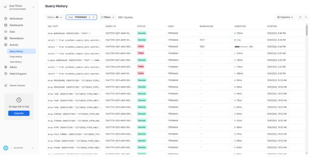
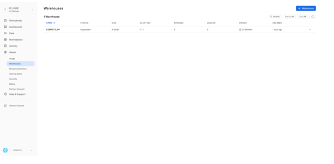
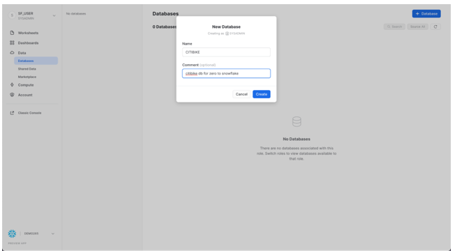
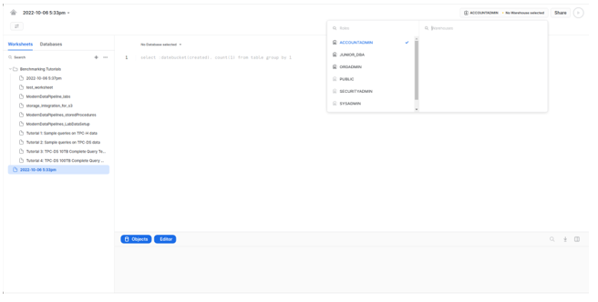
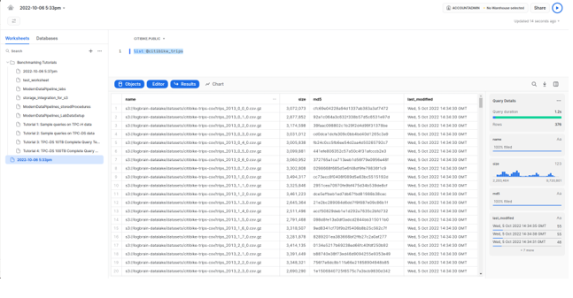
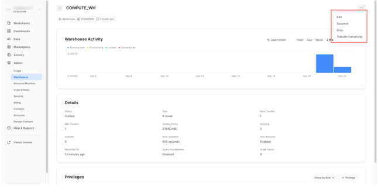
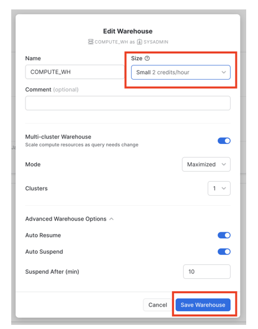
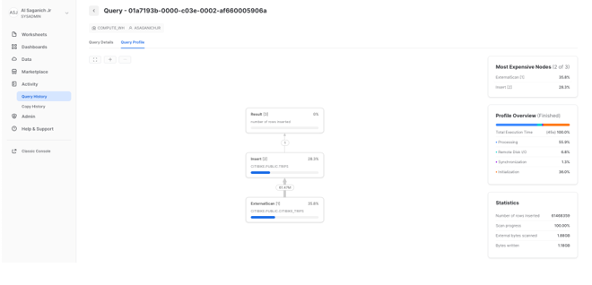
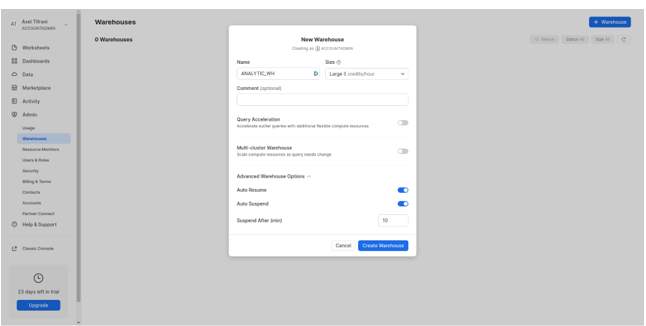

# Présentation du lab 1:

Ce premier lab vous présente l'interface utilisateur et les fonctionnalités de base de Snowflake. Il est spécialement conçu pour être utilisé avec Snowflake, essai gratuit de 30 jours sur https://trial.snowflake.com. Une fois le laboratoire terminé, vous devriez être prêt à charger vos propres données dans Snowflake et à découvrir ses fonctionnalités plus avancées.

## Conditions préalables:  
* Utilisation de l'environnement d'essai gratuit de 30 jours de Snowflake.  
* Connaissance de base de SQL et des concepts et objets de bases de données.  
* Familiarité avec les fichiers CSV délimités par des virgules et les données semi-structurées JSON.  


## Préparez votre environnement de lab:

Si ce n'est pas encore fait, inscrivez-vous pour un essai gratuit de Snowflake de 30 jours sur https://trial.snowflake.com.  
L'édition Snowflake (Standard, Enterprise, Business Critical, etc.), pour ce lab choisissez **Entreprise Edition**.  
Les fournisseurs de cloud (AWS, Azure, GCP), pour ce lab choisissez et la région **Europe (Irlande) eu-west-1**.     
Après votre inscription, vous recevrez un e-mail avec un lien d'activation et une URL pour accéder à votre compte Snowflake.  

### Connexion à l'interface utilisateur (UI) de Snowflake:

Ouvrez une fenêtre de navigateur et saisissez l'URL de votre environnement d'essai de 30 jours Snowflake qui a été envoyée avec votre e-mail d'inscription.
Vous devriez voir la boîte de dialogue de connexion suivante. Saisissez le nom d'utilisateur et le mot de passe que vous avez spécifiés lors de l'inscription :


### Navigation dans l'interface utilisateur de Snowflake:  

Cette section couvre les composants de base de l'interface utilisateur. Nous allons nous déplacer de haut en bas sur la marge de gauche.   


L'onglet Feuilles de calcul **Worksheets** fournit une interface pour soumettre des requêtes SQL, effectuer des opérations DDL (Data Definition Language) et DML (Data Mapinulation Language) et afficher les résultats à mesure que vos requêtes ou opérations se terminent. Une nouvelle feuille de calcul est créée en cliquant sur + Feuille de calcul en haut à droite.  


Le coin supérieur gauche contient les éléments suivants :  
* **Icône d'accueil (Home)** : utilisez-la pour revenir à la console principale/fermer la feuille de calcul.
* **Liste déroulante Worksheet_name** : le nom par défaut est l'horodatage de la création de la feuille de calcul. Cliquez sur l'horodatage pour modifier le nom de la feuille de calcul. La liste déroulante affiche également les actions supplémentaires que vous pouvez effectuer pour la feuille de calcul.    

Le coin supérieur droit contient les éléments suivants :  
* **Zone contextuelle (Context box)**: cela permet à Snowflake de savoir quel rôle et quel entrepôt utiliser pendant cette session. Il peut être modifié via l'interface utilisateur ou les commandes SQL.
* **Bouton Partager (Share)** : ouvrez le menu de partage pour partager avec d’autres utilisateurs ou copiez le lien vers la feuille de calcul.
* **Bouton Lecture/Exécuter (Play/Run)** : exécutez l'instruction SQL à l'endroit où se trouve actuellement le curseur ou plusieurs instructions sélectionnées.

Le volet du milieu contient les éléments suivants :  
Liste déroulante en haut pour définir le contexte de **base de données/schéma/objet** pour la feuille de calcul.  
Zone de travail générale dans laquelle vous saisissez et exécutez des requêtes et d'autres instructions SQL.  

Le volet inférieur affiche les résultats des requêtes et autres opérations. Comprend également 4 options **(Objet, Requête, Résultat, Graphique)**.   

L'onglet Tableaux de bord **Dashboards** vous permet de créer des affichages flexibles d'un ou plusieurs graphiques. Les vignettes et les widgets sont produits en exécutant des requêtes SQL qui renvoient les résultats dans une feuille de calcul.  


Sous Données **Data**, l'onglet Bases de données **Databases** affiche des informations sur les bases de données que vous avez créées ou auxquelles vous êtes autorisé à accéder. Vous pouvez créer, cloner, supprimer ou transférer la propriété de bases de données, ainsi que charger des données dans l'interface utilisateur.


Également sous Données **Data**, l'onglet Données partagées privées **Private Shared Data** est l'endroit où le partage de données peut être configuré pour partager facilement et en toute sécurité des tables Snowflake entre des comptes Snowflake distincts ou des utilisateurs externes, sans avoir à créer une copie des données. Nous aborderons le partage de données dans la autre section.  

L'onglet **Marketplace** est l'endroit où tout client Snowflake peut parcourir et consommer les ensembles de données mis à disposition par les fournisseurs. Il existe deux types de données partagées : publiques et personnalisées. Les données publiques sont des ensembles de données gratuits disponibles pour une interrogation instantanée. Les données personnalisées nécessitent de contacter le fournisseur de données pour obtenir l'approbation du partage des données.  


Sous Activité, il y a deux onglets Historique des requêtes et Historique des copies :  




* **Query History** est l'endroit où les requêtes précédentes sont affichées. Affichez les détails de toutes les requêtes exécutées au cours des 14 derniers jours à partir de votre compte Snowflake. Cliquez sur un ID de requête pour y accéder et obtenir plus d'informations.  
* **Copy History** affiche l'état des commandes de copie exécutées pour ingérer des données dans Snowflake.  
Sous **Admin**, l'onglet Entrepôt est l'endroit où vous configurez et gérez les ressources de calcul appelées entrepôts virtuels pour charger ou interroger des données dans Snowflake.



Également sous **Admin**,

* L'onglet Moniteurs de ressources **Resource Monitors** affiche tous les moniteurs de ressources qui ont été créés pour contrôler le nombre de crédits consommés par les entrepôts virtuels.  
Le sous-onglet **Roles** de l'onglet **Users** et **roles** affiche une liste des rôles et de leurs hiérarchies. Les rôles peuvent être créés, réorganisés et accordés aux utilisateurs dans cet onglet.

**ACCOUNTADMIN:**  
Pour la plupart de ces ateliers, vous resterez dans le rôle ACCOUNTADMIN qui dispose des privilèges nécessaires pour créer des entrepôts, des bases de données et d'autres objets dans un compte.  
Dans un environnement réel, vous utiliserez différents rôles pour les tâches de cet atelier et attribuerez les rôles à vos utilisateurs.


### Préparation du chargement des données
Commençons par préparer le chargement des données structurées des transactions des cyclistes Citi Bike dans Snowflake.
Cette section vous guide à travers les étapes pour :
* Créez une base de données et une table.
* Créez un stage externe.
* Créer un format de fichier pour les données.  
Obtenir des données dans Snowflake, Il existe de nombreuses façons d'obtenir des données dans Snowflake à partir de nombreux emplacements, notamment la commande COPY, l'ingestion automatique Snowpipe, des connecteurs externes ou des solutions ETL/ELT tierces. Pour plus d'informations sur l'importation de données dans Snowflake, consultez la documentation de Snowflake.  
Pour les besoins de cet atelier, nous utilisons la commande **COPY** et le stockage **AWS S3** pour charger les données manuellement. Dans un scénario réel, vous utiliseriez plus probablement un processus automatisé ou une solution ETL.


Les données que nous utiliserons sont des données de partage de vélos fournies par Citi Bike NYC. Les données ont été exportées et prédéfinies pour vous dans un compartiment Amazon AWS S3 dans la région EU-WEST-1.  
Les données comprennent des informations sur les temps de trajet, les emplacements, le type d'utilisateur, le sexe, l'âge, etc. Sur AWS S3, les données représentent 61,5 millions de lignes, 377 objets et 2 Go compressés.  
Vous trouverez ci-dessous un extrait de l'un des fichiers de données CSV de Citi Bike :


### Créer une base de données et une table:  
Tout d'abord, créons une base de données appelée **CITIBIKE** à utiliser pour charger les données structurées.
Assurez-vous que vous utilisez le rôle **ACCOUNTADMIN ** en sélectionnant Changer de **rôle > ACCOUNTADMIN.**  
Accédez à l'onglet Bases de données. Cliquez sur Créer, nommez la base de données **CITIBIKE*, puis cliquez sur CRÉER.



Accédez maintenant à l’onglet Feuilles de calcul. Si vous n'avez aucune feuille de calcul créée, cliquez sur créer une feuille de calcul.  
Sélectionnez les paramètres contextuels suivants :  
Rôle : **ACCOUNTADMIN**  
Entrepôt : **COMPUTE_WH**    
Nous utilisons ici l'interface utilisateur pour définir le contexte. Plus tard dans le laboratoire, nous accomplirons la même chose via des commandes SQL dans la feuille de calcul.

  

Ensuite, dans la liste déroulante de la base de données, sélectionnez les paramètres de contexte suivants :  
Base de données : **CITIBIKE**   
Schema : **PUBLIC**  


Pour faciliter le travail dans la feuille de calcul, renommez-la. Dans le coin supérieur gauche, cliquez sur le nom de la feuille de calcul, qui correspond à l'horodatage de la création de la feuille de calcul, et remplacez-le par **CITIBIKE_ONE**.  
Ensuite, nous créons une table appelée TRIPS à utiliser pour charger les données délimitées par des virgules. Au lieu d'utiliser l'interface utilisateur, nous utilisons la feuille de calcul pour exécuter le DDL qui crée la table. Copiez le texte SQL suivant dans votre feuille de calcul :  

```
create or replace table trips
(tripduration integer,
starttime timestamp,
stoptime timestamp,
start_station_id integer,
start_station_name string,
start_station_latitude float,
start_station_longitude float,
end_station_id integer,
end_station_name string,
end_station_latitude float,
end_station_longitude float,
bikeid integer,
membership_type string,
usertype string,
birth_year integer,
gender integer);
```  

Exécutez la requête en plaçant votre curseur n'importe où dans le texte SQL et en cliquant sur le bouton bleu Lire/Exécuter en haut à droite de la feuille de calcul. Ou utilisez le raccourci clavier [Ctrl]/[Cmd]+[Entrée].
Vérifiez que votre table TRIPS a été créée. Au bas de la feuille de calcul, vous devriez voir une section Résultats affichant un message « Table TRIPS créée avec succès ».  

Accédez à l'onglet Bases de données en cliquant sur l'icône ACCUEIL dans le coin supérieur gauche de la feuille de calcul. Cliquez ensuite sur Données > Bases de données. Dans la liste des bases de données, cliquez sur CITIBIKE > PUBLIC > TABLES pour voir votre table TRIPS nouvellement créée. Si vous ne voyez aucune base de données sur la gauche, développez votre navigateur car elles peuvent être masquées.  

Cliquez sur TRIPS et sur l'onglet Colonnes pour voir la structure de table que vous venez de créer.  

### Créer un External Stage:  

Nous travaillons avec des données structurées, délimitées par des virgules, qui ont déjà été stockées dans un compartiment S3 public et externe. Avant de pouvoir utiliser ces données, nous devons d'abord créer une scène qui spécifie l'emplacement de notre bucket externe.  

Dans l'onglet Bases de données, cliquez sur la base de données CITIBIKE et le schéma PUBLIC. Dans l'onglet Étapes, cliquez sur le bouton Créer, puis sur Étape > Amazon S3.  

 

Dans la boîte de dialogue « Créer un objet sécurisable » qui s'ouvre, remplacez les valeurs suivantes dans l'instruction SQL :  
nom_stage : **citibike_trips**  
URL : **s3://logbrain-datalake/datasets/citibike-trips-csv/**  

Remarque : Assurez-vous d'inclure la barre oblique finale (/) à la fin de l'URL, sinon vous rencontrerez des erreurs plus tard lors du chargement des données à partir du compartiment. Assurez-vous également d'avoir supprimé l'instruction 'credentials = (...)' qui n'est pas obligatoire. La commande create stage devrait ressembler exactement à celle présentée ci-dessus.  

Le compartiment S3 de cet atelier est public, vous pouvez donc laisser les options d'informations d'identification vides dans l'instruction. Dans un scénario réel, le compartiment utilisé pour une étape externe nécessiterait probablement des informations clés.  

  
   

Jetons maintenant un œil au contenu de l'étape citibike_trips. Accédez à l'onglet Feuilles de calcul et exécutez l'instruction SQL suivante :  

```
list @citibike_trips;
```

Dans les résultats du volet inférieur, vous devriez voir la liste des fichiers de le stage:  

   

### Créer un format de fichier :

Avant de pouvoir charger les données dans Snowflake, nous devons créer un format de fichier qui correspond à la structure des données.  
Dans la feuille de calcul, exécutez la commande suivante pour créer le format de fichier :  


```
create or replace file format csv type='csv'
  compression = 'auto' field_delimiter = ','
  record_delimiter = '\n'  skip_header = 0
  field_optionally_enclosed_by = '\042' trim_space = false
  error_on_column_count_mismatch = false escape = 'none'
  escape_unenclosed_field = '\134'
  date_format = 'auto' timestamp_format = 'auto'
  null_if = ('') comment = 'file format for ingesting csv';

```  

Vérifiez que le format de fichier a été créé avec les paramètres corrects en exécutant la commande suivante:

```
show file formats in database citibike;
```
### Chargement des données:
Dans cette section, nous utiliserons un entrepôt virtuel et la commande COPY pour lancer le chargement groupé de données structurées dans la table Snowflake que nous avons créée dans le dernier module.  

#### Redimensionner et utiliser un entrepôt pour le chargement des données:

Des ressources de calcul sont nécessaires pour charger les données. Les nœuds de calcul de Snowflake sont appelés entrepôts virtuels et ils peuvent être dimensionnés ou agrandis dynamiquement en fonction de la charge de travail, que vous chargiez des données, exécutiez une requête ou effectuiez une opération DML. Chaque charge de travail peut avoir son propre entrepôt afin qu'il n'y ait pas de conflit de ressources.  

Accédez à l'onglet Entrepôts (sous Admin). C'est ici que vous pouvez visualiser tous vos entrepôts existants et analyser leurs tendances d'utilisation.  

Notez l'option + Entrepôt dans le coin supérieur droit du haut. C'est ici que vous pouvez ajouter rapidement un nouvel entrepôt. Cependant, nous souhaitons utiliser l'entrepôt existant COMPUTE_WH inclus dans l'environnement d'essai de 30 jours.  

Cliquez sur la ligne de l'entrepôt COMPUTE_WH. Cliquez ensuite sur le ... (point point point) dans le texte du coin supérieur droit au-dessus pour voir les actions que vous pouvez effectuer sur l'entrepôt. Nous utiliserons cet entrepôt pour charger les données d'AWS S3.  

   

Cliquez sur Modifier pour parcourir les options de cet entrepôt. Dans cet atelier, nous ne verrons pas les entrepôts Mode, cluster ou multi-cluster.  

La liste déroulante Taille permet de sélectionner la capacité de l'entrepôt. Pour les opérations de chargement de données plus volumineuses ou les requêtes plus gourmandes en calcul, un entrepôt plus grand est recommandé. Les tailles se traduisent par les ressources de calcul sous-jacentes fournies par le fournisseur de cloud (AWS, Azure ou GCP) où votre compte Snowflake est hébergé.  

Il détermine également le nombre de crédits consommés par l'entrepôt pour chaque heure complète de fonctionnement. Plus la taille est grande, plus les ressources de calcul du fournisseur de cloud sont allouées à l'entrepôt et plus il consomme de crédits.  

Par exemple, le paramètre 4X-Large consomme 128 crédits pour chaque heure complète. Ce dimensionnement peut être modifié à la hausse ou à la baisse à tout moment d’un simple clic.  

Sous Options avancées d'entrepôt, les options vous permettent de suspendre automatiquement l'entrepôt lorsqu'il n'est pas utilisé afin qu'aucun crédit ne soit inutilement consommé. Il existe également une option permettant de reprendre automatiquement un entrepôt suspendu. Ainsi, lorsqu'une nouvelle charge de travail lui est envoyée, il redémarre automatiquement. Cette fonctionnalité active le modèle de facturation efficace de Snowflake « payez uniquement pour ce que vous utilisez » qui vous permet de faire évoluer vos ressources lorsque cela est nécessaire et de les réduire ou de les désactiver automatiquement lorsque vous n'en avez pas besoin, éliminant ainsi presque les ressources inutilisées.  

Attention : surveillez vos dépenses ! Pendant ou après cet atelier, vous devez faire attention à ne pas effectuer les actions suivantes sans raison valable, sinon vous risquez d'épuiser vos 400 $ de crédits gratuits plus rapidement que souhaité :  
* Ne désactivez pas la suspension automatique. Si la suspension automatique est désactivée, vos entrepôts continuent de fonctionner et de consommer des crédits même lorsqu'ils ne sont pas utilisés.  
* N'utilisez pas une taille d'entrepôt excessive compte tenu de la charge de travail. Plus l'entrepôt est grand, plus les crédits sont consommés.  

Nous allons utiliser cet entrepôt virtuel pour charger les données structurées dans les fichiers CSV (stockés dans le compartiment AWS S3) dans Snowflake. Cependant, nous allons d’abord modifier la taille de l’entrepôt pour augmenter les ressources de calcul qu’il utilise. Après le chargement, notez le temps pris puis, dans une étape ultérieure de cette section, nous refaireons la même opération de chargement avec un entrepôt encore plus grand, en observant son temps de chargement plus rapide.  

Modifiez la taille de cet entrepôt de données de X-Small à Small. puis cliquez sur le bouton Enregistrer l'entrepôt :  

  

Charger les données
Nous pouvons maintenant exécuter une commande COPY pour charger les données dans la table TRIPS que nous avons créée précédemment.  

Revenez à la feuille de calcul CITIBIKE_ONE dans l'onglet Feuilles de calcul. 

Assurez-vous que le contexte de la feuille de calcul est correctement défini :  

**Rôle : CITIBIKE_ONE**  
**Entrepôt : COMPUTE_WH**   
**Base de données : CITIBIKE**  
**Schéma : PUBLIC**  

Exécutez les instructions suivantes dans la feuille de calcul pour charger les données intermédiaires dans la table. Cela peut prendre jusqu'à 60 secondes.  

``` 
copy into trips from @citibike_trips file_format=csv PATTERN = '.*csv.*' ;

``` 

Dans le volet des résultats, vous devriez voir l'état de chaque fichier chargé. Une fois le chargement terminé, dans le volet Détails de la requête en bas à droite, vous pouvez faire défiler les différents statuts, statistiques d'erreurs et visualisations de la dernière instruction exécutée :  


Ensuite, accédez à l'onglet Historique des requêtes en cliquant sur l'icône Accueil, puis sur Activité > Historique des requêtes.  

Sélectionnez la requête en haut de la liste, qui doit être l'instruction COPY INTO qui a été exécutée pour la dernière fois. Sélectionnez l'onglet Profil de requête et notez les étapes d'exécution de la requête, les détails de la requête, les nœuds les plus coûteux et les statistiques supplémentaires.  




Rechargeons maintenant la table TRIPS avec un entrepôt plus grand pour voir l'impact des ressources de calcul supplémentaires sur le temps de chargement.  

Revenez à la feuille de calcul et utilisez la commande TRUNCATE TABLE pour effacer la table de toutes les données et métadonnées :  


``` 
truncate table trips

``` 

Vérifiez que la table est vide en exécutant la commande suivante :  


``` 
select * from trips limit 10;
``` 

Le résultat doit afficher "La requête n'a produit aucun résultat".  

Modifiez la taille de l'entrepôt en grande à l'aide de la commande suivante, ALTER WAREHOUSE :  

``` 
alter warehouse compute_wh set warehouse_size='large';
``` 

Vérifiez le changement à l'aide de la commande suivante, show warehouses;


``` 
show warehouses;
``` 

La taille peut également être modifiée à l'aide de l'interface utilisateur en cliquant sur la zone contextuelle de la feuille de calcul, puis sur l'icône Configurer (3 lignes) sur le côté droit de la zone contextuelle et en changeant Small à Large dans la liste déroulante Taille.

Exécutez la même instruction COPY INTO que précédemment pour charger à nouveau les mêmes données :  

``` 
copy into trips from @citibike_trips file_format=csv PATTERN = '.*csv.*' ;
``` 


Une fois le chargement terminé, revenez à la page Requêtes (icône Accueil > Activité > Historique des requêtes). Comparez les heures des deux commandes COPY INTO. Le chargement via le Grand entrepôt a été nettement plus rapide.  

#### Créer un nouvel entrepôt pour l'analyse des données
Pour en revenir à l'histoire du laboratoire, supposons que l'équipe Citi Bike souhaite éliminer les conflits de ressources entre ses charges de travail de chargement de données/ETL et les utilisateurs finaux analytiques utilisant des outils BI pour interroger Snowflake. Comme mentionné précédemment, Snowflake peut facilement y parvenir en attribuant différents entrepôts de taille appropriée à diverses charges de travail. Étant donné que Citi Bike dispose déjà d'un entrepôt pour le chargement des données, créons un nouvel entrepôt pour les utilisateurs finaux qui exécutent des analyses.  
Nous utiliserons cet entrepôt pour effectuer des analyses dans la section suivante.  
Accédez à l'onglet Admin > Entrepôts, cliquez sur + Entrepôt, nommez le nouvel entrepôt « et définissez la taille sur Large».  

Cliquez sur  Créer Warehouse pour créer un nouveau warehouse.




Exécuter quelques requêtes:  

Accédez à la feuille de calcul CITIBIKE_ONE et modifiez l'entrepôt pour utiliser le nouvel entrepôt que vous avez créé dans la dernière section.  
Le contexte de votre feuille de calcul doit être le suivant :  

**Rôle : ACCOUNTADMIN**  
**Entrepôt : ANALYTICS_WH (L)**  
**Base de données : CITIBIKE**   
**Schema : PUBLIC**  


1. Requête pour afficher pour chaque heure le nombre de trajets, la durée moyenne des trajets et la distance moyenne du trajet.  
 
```
select  date_trunc('hour', starttime) as "date",
        count(*) as "num trips",
        avg(tripduration)/60 as "avg duration (mins)",
        avg(haversine(start_station_latitude, 
        start_station_longitude, 
        end_station_latitude,
        end_station_longitude)) as "avg distance (km)"
from trips
group by 1 
order by 1;
```   

Snowflake dispose d'un cache de résultats qui contient les résultats de chaque requête exécutée au cours des dernières 24 heures. Celles-ci sont disponibles dans tous les entrepôts, de sorte que les résultats de requête renvoyés à un utilisateur sont disponibles pour tout autre utilisateur du système qui exécute la même requête.  

Non seulement ces requêtes répétées renvoient extrêmement rapides, mais ils n'utilisent pas non plus de crédits de calcul.  

Voyons le cache de résultats en action en exécutant à nouveau exactement la même requête.  

```
select  date_trunc('hour', starttime) as "date",
        count(*) as "num trips",
        avg(tripduration)/60 as "avg duration (mins)",
        avg(haversine(start_station_latitude, 
        start_station_longitude, 
        end_station_latitude,
        end_station_longitude)) as "avg distance (km)"
from trips
group by 1 
order by 1;
```   

2. Exécutons ensuite cette requête pour voir quels jours de la semaine sont les plus occupés :  

```
select
    dayname(starttime) as "day of week",
    count(*) as "num trips"
from trips
group by 1 order by 2 desc;
```

### Créer un clone de la table trips:

Exécutez la commande suivante dans la feuille de calcul pour créer une table de développement (dev).
    
```
create table trips_dev clone trips

```


## Travailler avec des données semi-structurées:

Pour ce faire, dans ce module nous allons :  

* Charger les données météorologiques au format JSON conservées dans un bucket S3 public.  
* Créez une vue et interrogez les données semi-structurées à l'aide de la notation par points SQL.  
* Exécuter une requête qui joint les données JSON aux données TRIPS d'un module précédent de ce guide.  
* Découvrez l'impact de la météo sur le nombre de déplacements.  

Les données JSON sont constituées d'informations météorologiques fournies par **OpenWeatherMap** détaillant l'historique conditions de la ville de New York du 05/07/2016 au 25/06/2019. Il est également organisé sur AWS S3 où le les données représentent 57,9 000 lignes, 61 objets et une taille totale de 2,5 Mo compressées.  


#### Créer la base de données :  

```
create database weather;

```

#### Créer la table weather:  

créons maintenant une table appelée **JSON_WEATHER_DATA** qui sera utilisé pour charger les données JSON. Dans la feuille de calcul, exécutez le texte SQL ci-dessous. Snowflake a un type de colonne spécial appelé **VARIANT** qui nous permettra de stocker l'intégralité de l'objet JSON et éventuellement de l'interroger directement.  

```
create table json_weather_data (v variant);

```

Vérifiez que votre table JSON_WEATHER_DATA a été créée. Au bas de la feuille de calcul, vous devriez voir une section « Résultats » qui indique « Table JSON_WEATHER_DATA créée avec succès ».  


#### Créer un external stage:

```
create stage nyc_weather url = 's3://logbrain-datalake/datasets/weather-nyc';

```

Vérifiez que le stage est crée.  

```
list @nyc_weather;

```

#### Charger les données dans la table:  

```
copy into json_weather_data from @nyc_weather file_format = (type=json);

```

Vérifiez que le données sont  chargées:  

```
select * from json_weather_data limit 10;
```

#### Créer une vue et interroger des données semi-structurées:  

créez une vue des données météorologiques JSON non structurées dans une vue en colonnes afin qu'il soit plus facile à comprendre et à interroger pour les analystes. 

```
create view json_weather_data_view as
select v[1]:"coco" as coco,
        v[1]:"country" as country,
        v[1]:"dwpt" as dwpt,
        v[1]:"elevation" as elevation,
        v[1]:"icao" as icao,
        v[1]:"latitude" as latitude,
        v[1]:"longitude" as longitude,
        v[1]:"name" as name,
        v[1]:"obsTime" as obsTime,
        v[1]:"prcp" as prcp,
        v[1]:"pres" as pres,
        v[1]:"region" as region,
        v[1]:"rhum" as rhum,
        v[1]:"snow" as snow,
        v[1]:"station" as station,
        v[1]:"temp" as temp,
        v[1]:"timezone" as timezone,
        v[1]:"tsun" as tsun,
        v[1]:"wdir" as wdir,
        v[1]:"weatherCondition" as wheatherCondition,
        v[1]:"wmo" as wmo,
        v[1]:"wpgt" as wpgt,
        v[1]:"wspd" as wspd
from json_weather_data;
```

#### Exécutez la requête suivantes sur le View:  

```
select * from json_weather_data_view
where date_trunc('month',observation_time) = '2018-01-01'
limit 20;

```

#### Utiliser une opération de jointure pour établir une corrélation entre les deux ensembles de données:  

Nous allons maintenant joindre les données météorologiques JSON à nos données CITIBIKE.PUBLIC.TRIPS pour déterminer le réponse à notre question initiale sur l'impact de la météo sur le nombre de trajets.  

```
select weather as conditions ,count(*) as num_trips
from citibike.public.trips
left outer join json_weather_data_view
on date_trunc('hour', observation_time) = date_trunc('hour', starttime)
where conditions is not null
group by 1 order by 2 desc;

```

#### Drop and Undrop a Table:  

Voyons d’abord comment restaurer des objets de données qui ont été supprimés accidentellement ou intentionnellement.  

```
drop table json_weather_data;

```

Vérifiez que la table est correctement supprimée:  

```
select * from json_weather_data limit 10;

```

Restorez la table:  

```
undrop table json_weather_data;

```


#### Roll Back a Table:  

Exécutez la commande suivante qui remplace tous les noms de stations du tableau par le mot "oups"

```
update trips set start_station_name = 'oops';

```

```
select * from start_station_name;

```

Exécutez maintenant une requête qui renvoie les 20 premières stations par nombre de trajets - remarquez à quel point nous avons foiré les noms des stations afin que nous n'obtenions qu'une seule ligne :  


```
select
start_station_name as "station",
count(*) as "rides"
from trips
group by 1
order by 2 desc
limit 20;
```

Normalement, nous devrions nous débrouiller et espérer avoir une sauvegarde qui traîne. Mais dans Snowflake, nous pouvons simplement exécuter des commandes pour trouver l'ID de requête de la dernière commande UPDATE et le stocker dans une variable appelée $QUERY_ID.


```
set query_id =
(select query_id from
table(information_schema.query_history_by_session (result_limit=>5))
where query_text like 'update%' order by start_time limit 1);
```

Recréez ensuite la table telle qu'elle était avant la mise à jour :  

```
create or replace table trips as
(select * from trips before (statement => $query_id));
```

Exécutez à nouveau l'instruction SELECT pour vérifier que les noms des stations ont été restaurés :  

```
select
start_station_name as "station",
count(*) as "rides"
from trips
group by 1
order by 2 desc
limit 20;

```
