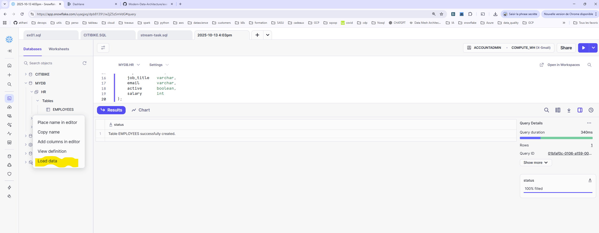
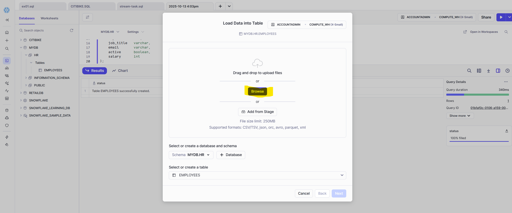
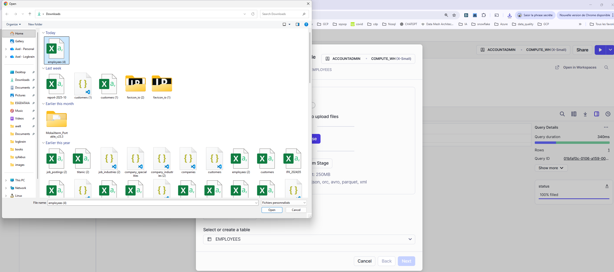
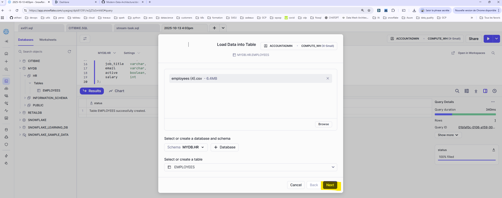
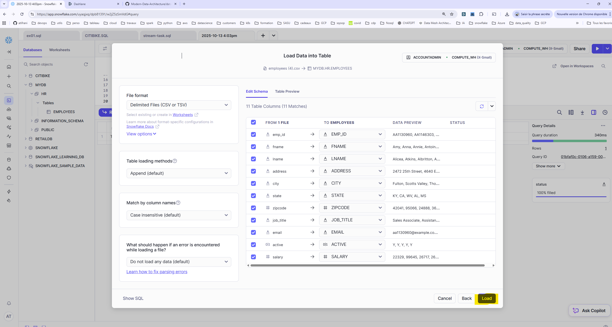

# Lab 1 — Introduction à Snowflake (Pas-à-pas)

> **Objectif**  
Découvrir l’interface Snowflake, créer les premiers objets (DB, table, stage, formats de fichier), **charger des données CSV depuis S3**, explorer/optimiser le chargement, puis **charger des données JSON** et les joindre aux données structurées. À la fin, vous saurez charger vos propres données et exécuter des requêtes simples.

---

## 0) Prérequis

- Compte Snowflake d’essai (**étudiants : 120 jours**) – inscrivez-vous avec l’adresse **de l’école**, société **MBAESG**, rôle **Étudiant**, **Edition : Enterprise**, **Cloud : AWS**, **Région : us-west-2**.
- lien pour créer votre compte:  https://signup.snowflake.com/?trial=student&cloud=aws&region=us-west-2&utm_source=handsonessentials&utm_campaign=uni-dww# 
- Bases de SQL (DDL/DML) et objets (database, schema, table…).  
- Connaissance des formats **CSV** et **JSON**.

> **Bon à savoir – Crédits**  
Conservez **Auto-Suspend** activé et utilisez une **taille d’entrepôt raisonnable** pour éviter d’épuiser vos crédits.  

## 1) Connexion & tour rapide de l’UI

1. Ouvrez l’URL reçue par email et connectez-vous.  
2. Onglets utiles :
   - **Worksheets** : écrire/exécuter du SQL, voir les **Results/Query/Graph**.
   - **Data › Databases** : gérer DB/schemas/tables, chargement via UI.
   - **Dashboards** : créer des graphiques à partir de requêtes.
   - **Activity › Query History / Copy History** : historiser exécutions/chargements.
   - **Admin › Warehouses** : créer/configurer les **entrepôts virtuels** (compute).
   - **Admin › Users & Roles** : rôles et hiérarchies.
3. Dans une **Worksheet**, vérifiez la **Context Box** (rôle, warehouse, DB, schema) et le bouton **Run**.


## 2) Préparer l’environnement de travail

> Dans ce lab nous utiliserons le rôle **ACCOUNTADMIN** pour simplifier (en production, privilégiez le principe du moindre privilège).

1. Ouvrez **Worksheets**.
2. **Contexte de session** (en haut de la feuille) :  
   - **Role** : `ACCOUNTADMIN`  
   - **Warehouse** : `COMPUTE_WH` (par défaut de l’essai)  

## 3) Créer une base de données

Dans Snowflake, une **base de données** regroupe plusieurs **schémas et objets** (tables, vues, stages...).

👉 Exécutez la commande suivante dans votre feuille de calcul :

```sql
-- Crée ou remplace la base de données 'MYDB'

create or replace database MYDB;
```

```sql
-- Liste les bases de données disponibles

show databases;
```

```sql
-- Crée ou remplace le schéma 'HR' dans la base 'MYDB'

create or replace schema HR;
```

```sql
-- définir le context

use database MYDB;

use schema HR;
```

## 4) Créer une table structurée (données tabulaires)

Nous allons créer une table EMPLOYEES avec des colonnes typées.

```sql
-- Création de la table EMPLOYEES
create or replace table EMPLOYEES
(
    emp_id      varchar,
    fname       varchar,
    lname       varchar,
    address     varchar,
    city        varchar,
    state       varchar,
    zipcode     int,
    job_title   varchar,
    email       varchar,
    active      boolean,
    salary      int
);
```

```sql
-- Vérifier que la table est bien crée

show tables in schema HR;

select * from EMPLOYEES;
```

## 5) Chager les données manuellement depuis l'UI











```sql
-- Afficher les données

select * from EMPLOYEES;
```

## 6) Créer une table pour stocker des données JSON

Snowflake permet de stocker des données semi-structurées (JSON, Parquet, etc.) via le type VARIANT.

```sql
-- Table pour stocker des documents JSON

create or replace table EMPLOYEES_JSON
(
    data variant
);
```

```sql
-- Vérifier que la table est bien crée

show tables in schema HR;
select * from EMPLOYEES_JSON;
```

## 7) Chager les données manuellement depuis l'UI


```sql
-- afficher les données

select * from EMPLOYEES_JSON;
```

## 8) Créer une vue sur les données JSON
Nous allons créer une vue pour extraire des champs spécifiques depuis le JSON stocké dans la table EMPLOYEES_JSON.
Cela permet d’exposer les données semi-structurées sous forme tabulaire.

```sql
-- Vue pour extraire des champs JSON sous forme tabulaire

create or replace view EMPLOYEES_CSV as
select 
    data:"birth-date"   as "birth-date",
    data:"first-name"   as "first-name",
    data:"job-title"    as "job-title",
    data:"last-name"    as "last-name",
    data:"location"     as "location"
from EMPLOYEES_JSON;
```

```sql
-- Afficher les données
select * from EMPLOYEES_CSV;
```

## 🎯 Résumé

Dans ce lab, vous avez appris à :

* Créer une base de données et un schéma dans Snowflake.

* Définir des tables structurées et semi-structurées.

* Créer une vue sur des données JSON.

* Naviguer et interroger les objets via la Snowflake UI.


## CITIBIKE Use Case:

**Contexte**

Citi Bike est le système de vélos en libre-service de la ville de New York, et l’un des plus grands au monde.
L’objectif de cet exercice est d’analyser les données d’utilisation afin de répondre à plusieurs questions clés que se pose l’entreprise :

* Où les usagers de Citi Bike se déplacent-ils ?

* À quels moments de la journée roulent-ils le plus ?

* Quelles distances parcourent-ils en moyenne ?

* Quelles stations sont les plus fréquentées ?

* Et quels jours de la semaine enregistrent le plus grand nombre de trajets ?

Cette analyse permettra de mieux comprendre les habitudes de déplacement des utilisateurs et d’identifier les tendances d’utilisation du service.

1. Ouvrez **Worksheets** et renommez la feuille en `CITIBIKE.sql`.
2. **Contexte de session** (en haut de la feuille) :  
   - **Role** : `ACCOUNTADMIN`  
   - **Warehouse** : `COMPUTE_WH` (par défaut de l’essai)  
   - Nous créerons la base et sélectionnerons DB/Schema ensuite.

## 1) Créer la base et la table `TRIPS` (CSV Citi Bike)

1. **Créer la database** `CITIBIKE` puis sélectionner le contexte :

   ```sql

   create or replace database CITIBIKE;

   use database CITIBIKE;

   use schema PUBLIC;

   ```

2. **Créer la table** `TRIPS` :

   ```sql
   create or replace table TRIPS (
     tripduration integer,
     starttime timestamp,
     stoptime timestamp,
     start_station_id integer,
     start_station_name string,
     start_station_latitude float,
     start_station_longitude float,
     end_station_id integer,
     end_station_name string,
     end_station_latitude float,
     end_station_longitude float,
     bikeid integer,
     membership_type string,
     usertype string,
     birth_year integer,
     gender integer
   );
   ```

## 2) Créer le **Stage** externe (S3) & le **Format de fichier CSV**

> Les fichiers CSV Citi Bike sont déjà publiés en lecture publique sur S3.

1. **Stage** (standardisez le nom : `citibike_trips`) :

   ```sql
   -- Stage public S3 (notez le / final)
   create or replace stage citibike_csv
     url='s3://logbrain-datalake/datasets/citibike-trips-csv/';
   ```

   > **Astuce** : pas d’identifiants pour ce bucket public.

2. **Lister le contenu du stage** :

   ```sql
   list @citibike_csv;
   ```

3. **Format de fichier** `csv` :

   ```sql
   create or replace file format csv
     type = 'CSV'
     field_delimiter = ','
     record_delimiter = '\n'
     skip_header = 1
     field_optionally_enclosed_by = '\042'
     null_if = (''); 
   ```

4. **Contrôler** :

   ```sql
   show file formats in database CITIBIKE;
   ```

## 5) Charger les données (COPY INTO) & mesurer l’impact de la taille d’entrepôt

### 5.1 Premier chargement (entrepôt **Small**)

1. **(Optionnel)** redimensionner `COMPUTE_WH` en **Small** via Admin › Warehouses ou SQL :

   ```sql
   alter warehouse COMPUTE_WH set warehouse_size='SMALL';
   ```

2. **Contexte** :

   ```sql
   use role ACCOUNTADMIN;
   use warehouse COMPUTE_WH;
   use database CITIBIKE;
   use schema PUBLIC;
   ```

3. **Charger** :

   ```sql
   copy into TRIPS
   from @citibike_csv
   file_format = csv
   pattern = '.*\.csv.*';
   ```

4. **Vérifier** : dans les **Results**, status par fichier + **Copy History** (Activity).


```sql
-- Affichez les données
select * from trips;

-- Compter le nombre de lignes
select count(*) from trips
```

### 5.2 Rechargement comparatif (entrepôt **LARGE**)

1. **Purge** :

   ```sql
   -- Vider la table

   truncate table TRIPS;
   ```

   Vérifiez :

   ```sql
   select * from TRIPS limit 10;  -- aucun résultat attendu
   ```

2. **Redimensionner** :

   ```sql
   alter warehouse COMPUTE_WH set warehouse_size='LARGE';
   show warehouses;
   ```

3. **Relancer le chargement** :

   ```sql
   copy into TRIPS
   from @citibike_trips
   file_format = csv
   pattern = '.*\.csv.*';
   ```

4. **Comparer** dans **Activity › Query History** : le chargement en LARGE doit être plus rapide.

```sql
-- Affichez les données
select * from trips;

-- Compter le nombre de lignes
select count(*) from trips
```

> **Rappel** : remettez l’entrepôt à une taille plus petite après vos tests si vous continuez à travailler.

  ```sql
   alter warehouse COMPUTE_WH set warehouse_size='XSMALL';
   show warehouses;
   ```

## 6) Créer un entrepôt dédié **ANALYTICS_WH** (pour les requêtes)

1. **Créer** :
   ```sql
   create or replace warehouse ANALYTICS_WH
     warehouse_size = 'LARGE'
     auto_suspend = 5
     auto_resume = true
     initially_suspended = true;
   ```
2. **Basculer le contexte** :
   ```sql
   use warehouse ANALYTICS_WH;
   ```

## 7) Exécuter quelques requêtes analytiques

1. **Par heure : nb trajets, durée et distance moyennes**  
   *(la fonction `HAVERSINE` calcule une distance géodésique approx. en km)*  
   ```sql
   select
     date_trunc('hour', starttime) as "Hour",
     count(*)                           as "num trips",
     avg(tripduration)/60               as "avg duration (mins)",
     avg(haversine(
       start_station_latitude, start_station_longitude,
       end_station_latitude,  end_station_longitude
     ))                                 as "avg distance (km)"
   from TRIPS
   group by 1
   order by 1;
   ```

   Relancez **exactement la même requête** et observez le **Result Cache** (retour instantané, sans crédits).

2. **Jours de la semaine les plus chargés**

   ```sql
   select
     dayname(starttime) as "day of week",
     count(*)           as "num trips"
   from TRIPS
   group by 1
   order by 2 desc;
   ```

3. **Clone** de la table pour dev :
   ```sql
   create or replace table TRIPS_DEV clone TRIPS;
   ```

## 8) Données **JSON** (météo NYC) : chargement & vue « colonnes »

1. **Table JSON (colonne VARIANT)** :
   ```sql
   create or replace table JSON_WEATHER_DATA (v variant);
   ```
2. **Stage S3 JSON** :
   ```sql
   create or replace stage NYC_WEATHER
     url='s3://logbrain-datalake/datasets/weather-nyc-json/';
   list @NYC_WEATHER;
   ```
3. **Chargement JSON** :
   ```sql
   copy into JSON_WEATHER_DATA
   from @NYC_WEATHER
   file_format = (type = json);
   ```
   Vérifier :
   ```sql
   select * from JSON_WEATHER_DATA limit 10;
   ```
4. **Format JSON à outer array** :
   ```sql
   create or replace file format json
     type = 'JSON'
     strip_outer_array = true;

   truncate table JSON_WEATHER_DATA;

   copy into JSON_WEATHER_DATA
   from @NYC_WEATHER
   file_format = json;
   ```
6. **Vue lisible** :
   
   ```sql
     create or replace table weather as
       select 
      v:"coco"::STRING as "coco" ,
      v:"country"::STRING as "country",
      v:"dwpt"::FLOAT as "dwpt",
      v:"elevation"::STRING as "elevation",
      v:"icao"::STRING as "icao",
      v:"latitude"::DECIMAL as "latitude",
      v:"longitude"::DECIMAL as "longitude",
      v:"name"::STRING as "name",
      v:"obsTime"::TIMESTAMP as "obsTime",
      v:"prcp"::STRING as "prcp" ,
      v:"pres"::DECIMAL as "pres",
      v:"region"::STRING as "region",
      v:"rhum"::STRING as "rhum",
      v:"snow"::STRING as "snow",
      v:"station"::STRING as "station",
      v:"temp"::DECIMAL "temp",
      v:"timezone"::STRING as "timezone",
      v:"tsun"::STRING as "tsun",
      v:"wdir"::STRING as "wdir",
      v:"weatherCondition"::STRING as "weatherCondition",
      v:"wmo"::STRING as "wmo",
      v:"wpgt"::STRING as "wpgt",
      v:"wspd"::DECIMAL as "wspd"
    from json_weather_data;
   ```
7. **Filtre d’exemple** :
   ```sql
   select *
   from WEATHER
   where date("obstime") = '2018-01-01'
   limit 20;
   ```

## 9) Corréler météo (JSON) & trajets (CSV)

On joint sur la **date** de l’observation météo et la **date de départ** du trajet.

```sql
use database CITIBIKE;  
use schema PUBLIC;
use warehouse ANALYTICS_WH;

select
  "weatherCondition",
  count(*) as num_trips
from CITIBIKE.PUBLIC.TRIPS
left join CITIBIKE.PUBLIC.WEATHER
  on date("obsTime") = date(starttime)
where "weatherCondition" is not null
group by 1
order by 2 desc;
```

## 10) Time-Travel : **Undrop** & **Rollback**

1. **Undrop d’une table supprimée** :
   ```sql
   use database CITIBIKE; 
   
   use schema PUBLIC;

   drop table JSON_WEATHER_DATA;

   -- Vérification : doit renvoyer 0 ligne / erreur si vous requêtez
   select * from JSON_WEATHER_DATA limit 10;

   undrop table JSON_WEATHER_DATA;
   ```
2. **Rollback après une mise à jour erronée** :

   ```sql
   use database CITIBIKE; 
   use schema PUBLIC;

   -- Erreur volontaire
   update TRIPS set start_station_name = 'oops';

   -- Retrouver l'ID de la dernière UPDATE
   set query_id = (
     select query_id
     from table(information_schema.query_history_by_session(result_limit=>5))
     where query_text ilike 'update%'
     order by start_time desc
     limit 1
   );

   -- Restaurer la table avant l'UPDATE
   create or replace table TRIPS as
   select * from TRIPS before (statement => $query_id);

   -- Re-vérifier
   select start_station_name as "station", count(*) as "rides"
   from TRIPS
   group by 1
   order by 2 desc
   limit 20;
   ```


## 11) (Bonus) Mini-app **Streamlit** dans Snowflake

### Introduction à Streamlit

Avant de créer notre mini-application connectée à Snowflake, découvrons rapidement **Streamlit**, un framework Python simple et puissant pour créer des interfaces web interactives destinées à la data science et à l’analyse de données.

Streamlit permet de transformer un **script Python** en application web en quelques lignes seulement, sans connaissances en développement web.

* **Exemple 1 :** afficher du texte et des graphiques

```python
import streamlit as st
import pandas as pd

st.title("Exemple Streamlit : Visualisation simple")

# Créer un petit DataFrame
data = pd.DataFrame({
    "Jour": ["Lundi", "Mardi", "Mercredi", "Jeudi", "Vendredi"],
    "Ventes": [100, 150, 90, 200, 175]
})

st.write("### Tableau des ventes hebdomadaires")
st.dataframe(data)

st.bar_chart(data, x="Jour", y="Ventes")
```

* **Exemple 2 :** ajouter des widgets interactifs

```python
import streamlit as st

st.title("Exemple Streamlit : Interaction")

nom = st.text_input("Entrez votre prénom :")
age = st.slider("Indiquez votre âge :", 0, 100, 25)

if st.button("Afficher le message"):
    st.success(f"Bonjour {nom}, vous avez {age} ans !")
```

> Exemple d’app Snowflake/Streamlit pour explorer les trajets par jour de semaine.

```python
import streamlit as st
from snowflake.snowpark.context import get_active_session

st.title("Analyse des trajets Citi Bike")
st.write("Filtrez par jour de semaine et affichez les stations les plus utilisées.")

option = st.selectbox(
    "Jour de la semaine",
    ("Mon","Tue","Wed","Thu","Fri","Sat","Sun")
)

session = get_active_session()

sql = f"""
  select start_station_name as START_STATION_NAME,
         count(*) as NBTRIPS
  from CITIBIKE.PUBLIC.TRIPS
  where dayname(starttime) = '{option}'
  group by start_station_name
  order by NBTRIPS desc
  limit 10
"""
data = session.sql(sql).to_pandas()

st.subheader("Top 10 stations")
st.bar_chart(data=data, x="START_STATION_NAME", y="NBTRIPS")

sql2 = """
  select dayname(starttime) as DAY_OF_WEEK,
         count(*) as NB_TRIPS
  from CITIBIKE.PUBLIC.TRIPS
  group by dayname(starttime)
"""
data2 = session.sql(sql2).to_pandas()

st.subheader("Nombre de trajets par jour")
st.bar_chart(data=data2, x="DAY_OF_WEEK", y="NB_TRIPS")
```

## 12) Checklist de fin de lab

- [ ] DB `CITIBIKE` + table `TRIPS` créées  
- [ ] **Stage** `citibike_trips` (S3) + **file format** `csv`  
- [ ] `COPY INTO TRIPS` exécuté (Small vs Large comparés)  
- [ ] Entrepôt d’analyse `ANALYTICS_WH` créé et utilisé  
- [ ] Requêtes d’exploration exécutées (heure/jour)  
- [ ] DB `WEATHER` + table `JSON_WEATHER_DATA` + vue `JSON_WEATHER_DATA_VIEW`  
- [ ] Jointure météo ↔ trajets exécutée  
- [ ] `UNDROP` et **Time-Travel** testés  
- [ ] (Bonus) App Streamlit fonctionnelle

---

## 13) Dépannage rapide

- **`Permission denied`** : vérifiez le **Role** (ACCOUNTADMIN pour le lab), et le **Context** (DB/Schema/Warehouse).  
- **`Cannot access stage`** : URL S3 correcte **avec `/` final** ? Stage au bon nom (`citibike_trips`) ?  
- **`COPY` ne charge rien** : vérifiez `pattern`, `file_format`, et `list @stage` pour voir les fichiers.  
- **Crédits qui fondent** : repassez vos entrepôts en **Small** et gardez **Auto-Suspend**.
