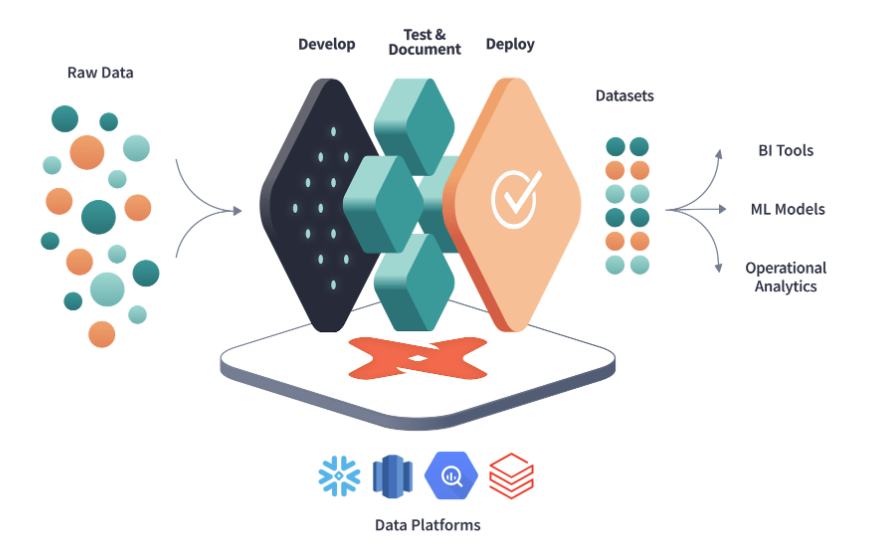

# Introduction à dbt core:

Si vous travaillez en tant qu'analyste/ingénieur de données, vous travaillez certainement avec SQL. Bien que SQL soit simple à apprendre, vous vous êtes peut-être déjà demandé s'il n'était pas possible d'écrire du SQL orienté objet. C'est là qu'intervient dbt. L'outil de transformation de données DBT (Data Build Tool).

**dbt** (Data Build Tool)  est un outil et un framework open source de transformation de données que vous pouvez utiliser pour définir, tester et déployer des transformations SQL.

dbt transforme les données brutes de l’entrepôt de données en produits de données fiables. Vous écrivez de simples instructions SQL de type `SELECT`, et dbt se charge du travail complexe en créant des modèles de données modulaires et maintenables qui alimentent l’analytique, les opérations et l’IA, remplaçant ainsi le besoin de code de transformation complexe et fragile.

**dbt** (Data Build Tool) est devenu un composant fondamental de la **Modern Data Stack** pour manipuler des données dans des plateforme cloud comme **Snowflake**, **BigQuery** ou **Redshift**. Sa fonction principale est d'organiser et d'orchestrer efficacement la logique métier appliquée aux données dans un entrepôt de données.

Pour déployer un projet DBT en production, la société à l'origine de DBT propose une version Cloud **dbt labs (Version Payante)** offrant diverses fonctionnalités comme l'intégration native avec Github et GitLab.

L'alternative, est la version **dbt Core (Version Gratuite)**, dans ce cas, c'est à vous de construire l'intégration native avec Github et GitLab.

Pour cela, dbt core offre de nombreuses fonctionnalités, comme :

* Le référencement de modèles afin de structurer son code et de favoriser le principe DRY (Don’t Repeat Yourself)
* La visualisation du Data Lineage afin d’avoir une vision claire des transformations
* La facilité de développer des tests
* La génération automatique de documentation

C’est donc devenu un outil très populaire pour la transformation de données avec une communauté grandissante.

