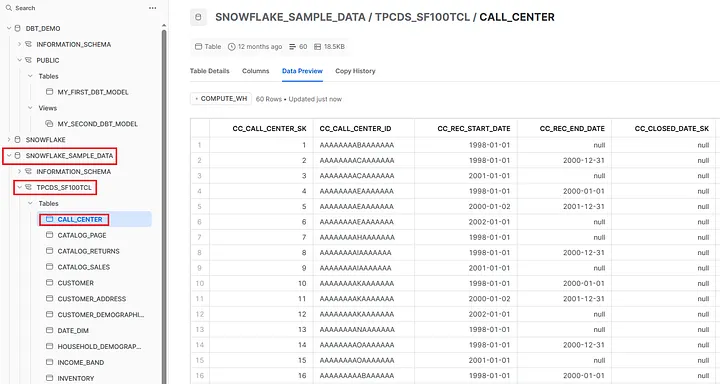
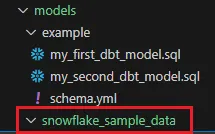
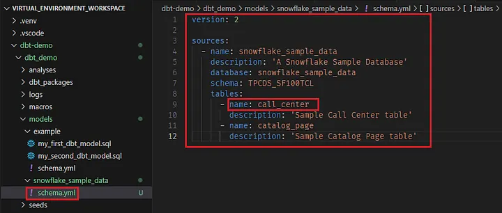
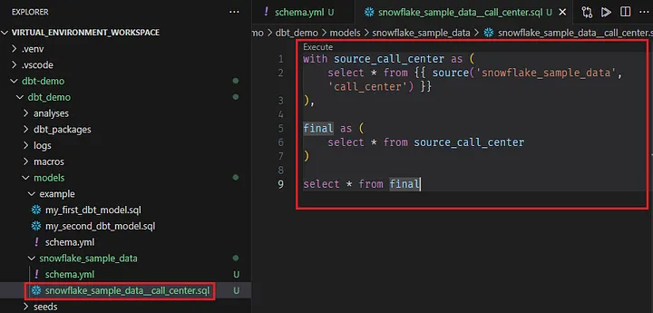
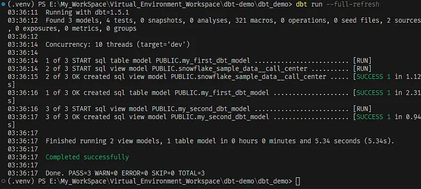
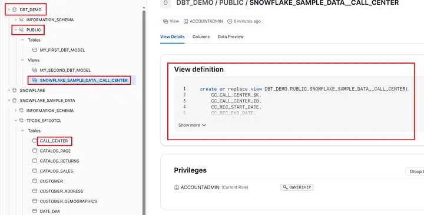

## Définir une source dans un projet dbt

Dans dbt, les sources désignent les origines des données à partir desquelles tu extrais des informations pour les analyser et les transformer. Elles peuvent inclure un large éventail de dépôts de données, comme des bases de données, des fichiers, des API ou même des services externes.

Définir des sources permet d’établir une connexion à ces dépôts de données et d’accéder aux données pertinentes pour ton analyse.

Dans ce tutoriel, nous allons définir une table Snowflake d’exemple comme source brute, puis l’utiliser pour créer une vue cible dans notre nouvelle base de données.

Choisissons la table CALL_CENTER comme source.





### Étape 1 — Créer un sous-dossier snowflake_sample_data dans models

Dans un projet dbt, les sources se trouvent dans le dossier models. Créons donc un sous-dossier à cet endroit pour y placer nos définitions de sources.




### Étape 2 — Créer un fichier schema.yaml et définir les sources

Crée un fichier schema.yaml et définis la source comme montré ci-dessous.




## Créer un modèle en se basant sur cette source

Créons maintenant un modèle qui fera référence à cette source.



Étape 6 — Exécuter ton modèle pour créer une vue dans la base de données et le schéma cibles

Lance la commande dbt run pour exécuter tes modèles.

```
dbt run
```


Cela devrait créer une nouvelle vue dans ta base de données, qui pointera vers la table CALL_CENTER.



Une table devra toujours être rafraîchie par dbt afin d’être mise à jour.
Une vue, en revanche, sera toujours à jour puisqu’elle reflète en temps réel les tables sous-jacentes auxquelles elle fait référence.


## Les matérialisations dans dbt

Les matérialisations sont des stratégies permettant de stocker les modèles dbt dans un entrepôt de données. dbt intègre quatre types de matérialisations :

1. **View** (Vue)

Avec la matérialisation view, ton modèle est reconstruit comme une vue à chaque exécution, via une instruction create view as.

**Avantages** : Aucune donnée supplémentaire n’est stockée ; les vues construites à partir des données sources contiennent toujours les enregistrements les plus récents.

**Inconvénients** : Les vues qui réalisent des transformations complexes ou qui s’empilent sur d’autres vues sont lentes à interroger.

Quand l’utiliser : Idéal pour les modèles qui n’effectuent pas de transformations lourdes (ex. : renommage, conversion de types de colonnes).

2. **Table** (Table)

Avec la matérialisation table, ton modèle est reconstruit comme une table à chaque exécution, via une instruction create table as.

**Avantages** : Les tables sont rapides à interroger.

**Inconvénients** : Les tables peuvent être longues à reconstruire, surtout pour des transformations complexes. Les nouveaux enregistrements des données sources ne sont pas automatiquement ajoutés.

3. **Incremental** (Incrémentiel)

Les modèles incrémentiels permettent à dbt d’insérer ou de mettre à jour uniquement les enregistrements modifiés depuis la dernière exécution.

**Avantages** : Réduction significative du temps de construction, car seules les nouvelles données sont transformées.

**Inconvénients** : Les modèles incrémentiels nécessitent une configuration supplémentaire et constituent une utilisation avancée de dbt.

4. **Ephemeral** (Éphémère)

Les modèles éphémères ne sont pas matérialisés directement dans la base de données. dbt intègre leur code dans les modèles dépendants sous forme de CTE (Common Table Expression).

**Avantages** : On peut écrire une logique réutilisable, et ces modèles contribuent à garder l’entrepôt propre en limitant l’encombrement.

**Inconvénients** : On ne peut pas interroger directement un modèle éphémère. Certaines opérations (comme des macros via dbt run-operation) ne peuvent pas référencer (ref) des nœuds éphémères. Une utilisation excessive peut aussi compliquer le débogage des requêtes.

⚠️ Remarque : Les modèles Python dans dbt ne supportent que deux matérialisations : table et incremental.


## Configuration des matérialisations

Par défaut, les modèles dbt sont matérialisés en views.
On peut configurer un modèle avec une matérialisation différente de deux façons :

1. En utilisant la configuration directement dans le fichier SQL du modèle (avec le bloc {{ config(materialized='...') }}).

```
{{ config(materialized='table', sort='timestamp', dist='user_id') }}

select *
from ...
```


2. En définissant la matérialisation dans un fichier dbt_project.yml.

```
name: my_project
version: 1.0.0
config-version: 2

models:
  my_project:
    events:
      # materialize all models in models/events as tables
      +materialized: table
    csvs:
      # this is redundant, and does not need to be set
      +materialized: view
```