# Introduction a DBT:

Dans le monde de l’analyse de données, la capacité à transformer et analyser les données de manière efficace est primordiale. C’est là qu’intervient la puissante combinaison de DBT (Data Build Tool) et Snowflake.


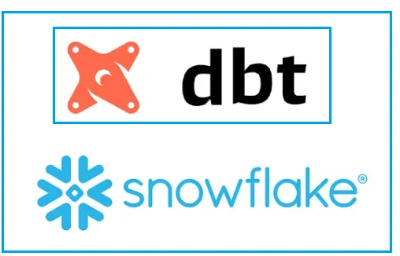


## Qu’est-ce que dbt (Data Build Tool) ?

dbt™ (data build tool) est un framework de traitement de données, basé sur Python, qui permet d’appliquer des transformations sur les données à l’intérieur d’un entrepôt de données tel que Snowflake, Redshift, BigQuery, mais aussi PostgreSQL.

**dbt est le T dans ELT (Extract-Load-Transform)**  

dbt prend ton code, le compile en SQL, puis l’exécute directement sur ta base de données. Selon dbt, les ingénieurs en analytique fournissent aux utilisateurs finaux des ensembles de données propres, en modélisant les données de manière à leur permettre de répondre eux-mêmes à leurs questions.

Cela signifie qu’un Analytics Engineer est capable de transformer des données brutes en données métier et, surtout, qu’il peut le faire de manière collaborative au sein d’une équipe d’ingénierie analytique en utilisant dbt.

Contrairement aux solutions de transformation de données low-code/no-code, dbt est un outil en ligne de commande qui permet de construire chaque modèle en utilisant du SQL et du code Jinja, tout en imposant l’utilisation d’un outil de versionnement. C’est un point important, car cela permet d’adopter de bonnes pratiques comme le développement par branches, le code DRY (Don’t Repeat Yourself), la revue de code, l’intégration et le déploiement continus, les tests de code, etc.


## Composants de dbt:


* **Models** : C’est ici que tu écris tes modèles SQL.

* **Tests** : C’est ici que tu peux stocker tes tests de données.

* **Macros*** : C’est ici que tu peux définir des macros pour simplifier ton code SQL.

* **Analysis** : C’est ici que tu peux écrire du code SQL pour analyser tes données.

* **Logs** : Ce sont les journaux d’exécution. Ils sont générés lorsqu’une commande dbt run est exécutée.

* **Target Directories** (par ex. dev) : Que ce soit lors de la compilation, de l’exécution ou de la génération de documentation, ces répertoires sont créés. Ils contiennent tout le contenu métadonnée ainsi que le code SQL compilé.


### Types de fichiers dbt

* **Fichiers .md** : Fichiers de documentation utilisés pour documenter les modèles dbt.

* **Fichiers .yml** : Fichiers de configuration. La plupart contiennent du templating Jinja. Ces configurations peuvent aussi être (et le sont fréquemment) remplacées dans un fichier .sql selon les besoins de conception et de performance.

* **Fichiers .sql** : Contiennent les modèles et les tests. Les modèles sont des requêtes SELECT qui produisent une nouvelle table (ou une table mise à jour de manière incrémentale) ou une vue dans l’entrepôt de données. Ces fichiers sont compilés en scripts SQL exécutables, prêts à être lancés sur la base de données spécifiée


### dbt Cloud:

Application web accompagnée d’un IDE. Elle permet de créer, gérer et planifier des jobs dbt. Cependant, il s’agit d’une solution payante avec différents plans tarifaires (Developer, Team, Enterprise).

### dbt Core:

Interface en ligne de commande, exécutée via un terminal. C’est un package open source qui peut être installé dans un environnement Python. Il offre davantage d’autonomie et de flexibilité pour tes projets, mais tu devras orchestrer et gérer tes jobs avec des solutions personnalisées (Airflow, Prefect, Dagster, Cron, etc.).


## Prérequis pour créer un projet dbt

* Un compte Snowflake en version d’essai (ou payant)

* Un compte GitHub gratuit

### Étape 1: Configurer un dépôt GitHub

### Étape 1.1 — Créer un dépôt GitHub vide de base
Créons maintenant un dépôt GitHub simple où nous allons stocker tout notre code **dbt-snowflake**.


### Étape 2 — Clonnez votre dépôt guithub 

### Étape 2.1 : Créez une intégration git:

* Création de git secret:

```
-- Create a secret to store a password
CREATE OR REPLACE SECRET git_secret
    TYPE = password
    USERNAME = 'atifrani'
    PASSWORD = '********'
```
Pour récuperer le password, vous devez générer un token depuis votre compte github.


* Création de API integration:

```
-- Create api integration
CREATE OR REPLACE API INTEGRATION git_api_integration
    API_PROVIDER = git_https_api
    API_ALLOWED_PREFIXES = ('https://github.com/atifrani')
    ALLOWED_AUTHENTICATION_SECRETS = (git_secret)
    ENABLED = TRUE;
```

* Creation du Repository stage
```
-- Create git stage
CREATE OR REPLACE GIT REPOSITORY db-snowflake
    API_INTEGRATION = git_api_integration
    GIT_CREDENTIALS = git_secret
    ORIGIN = 'https://github.com/atifrani/dbt-snowflake.git'
``` 

* Synchronisation avec Github
|```
ALTER GIT REPOSITORY db-snowflake FETCH;
```
### Étape 3: Configurer Snowflake

### Étape 3.1 — Créer une base de données vide dans Snowflake
Ensuite, allons dans Snowflake et créons une base de données. C’est là que nous allons stocker nos modèles dbt.

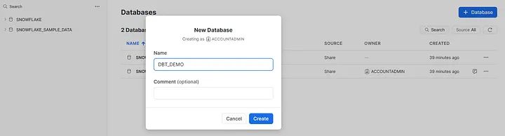

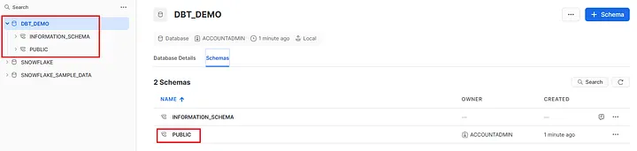

### Étape 3.2 — Récupérer l’URL du compte
Enregistre l’URL de ton compte. Tu en auras besoin pour configurer ton projet dbt.

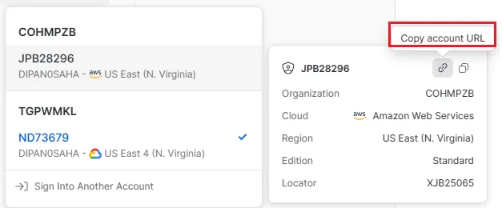

### Étape 4: Configurer un nouveau projet dbt sur ta machine locale

### Étape 4.1 — Créer un nouveau projet dbt
Exécute la commande suivante pour créer un nouveau projet dbt appelé dbt_demo.

```
cd dbt-snowflake

dbt init dbt-project
```

### Étape 5 — Valider la nouvelle structure de dossiers et le fichier profiles.yml

Structure du dossier du projet

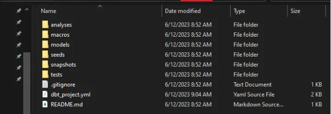


Editez le fichier **profiles.yml** qui se trouve à la racine de votre utilisateur dans le fichier **.dbt**

Le fichier profiles.yml ressemblera à ceci :


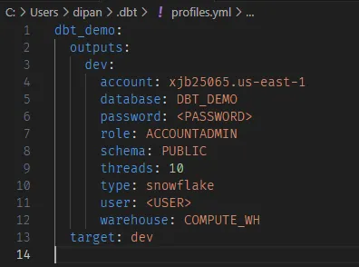


Note que tu peux créer plusieurs **profils** dans le fichier **profiles.yml**, par exemple un pour **dev** et un autre pour **prod**.

Si tu veux utiliser un fichier de profil différent, tu peux utiliser l’argument **--profiles-dir** pour indiquer à dbt où se trouve le fichier profiles.yml.

```
dbt init dbt_project --profiles-dir=profiles
```

### Étape 6 — Tester la connexion à Snowflake avec dbt

Utilise la commande **dbt debug** pour tester la connexion à Snowflake.

Appuie sur Entrée ou clique pour afficher l’image en taille réelle.

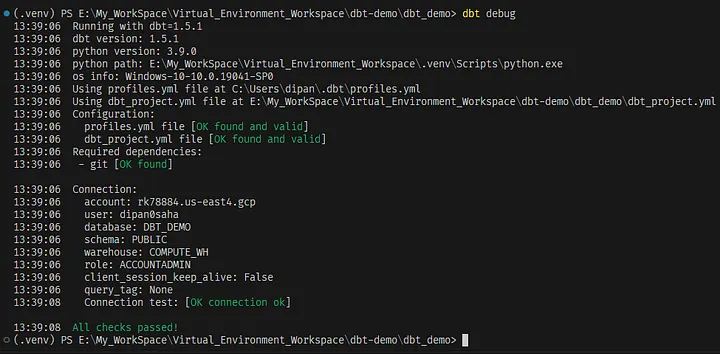


### Étape 7 — Construire les modèles dbt d’exemple

Utilise la commande dbt run pour construire les modèles de données fournis avec le nouveau projet.

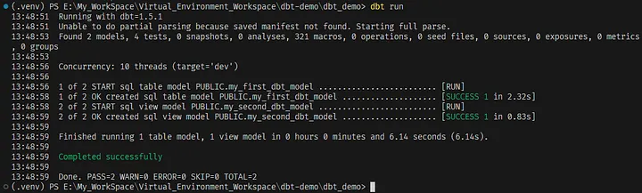

### Étape 8 — Valider les nouvelles tables et vues dans Snowflake

Appuie sur Entrée ou clique pour afficher l’image en taille réelle.

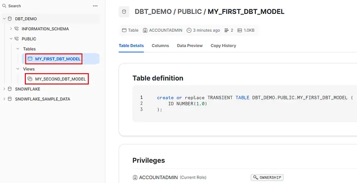


###  Étape 9 - Charger ton code projet sur le dépôt GitHub

Exécute le code ci-dessous pour téléverser ton projet mis à jour vers le dépôt GitHub afin de le conserver pour référence future.

```
git status 

git add .

git commit -m "My First Commit"

git push
```

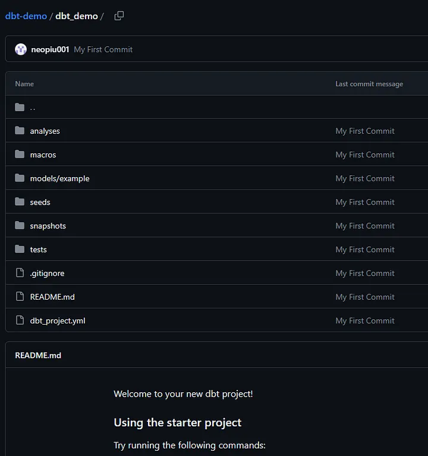

###  Étape 10 - Créer la documentation pour ton projet

Pour générer automatiquement la documentation de ton projet, utilise les commandes suivantes :

```
dbt docs generate

dbt docs serve
```

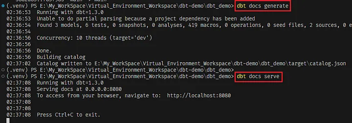

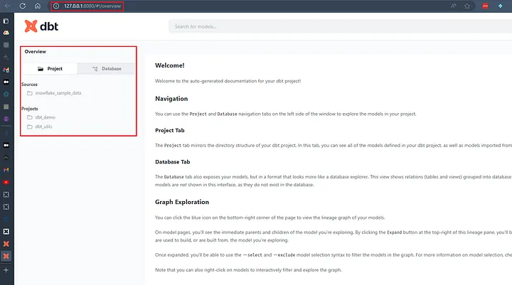

## Avantages de l’utilisation de dbt

* Logiciel open source gratuit et bien documenté

* Outil basé sur SQL facile à configurer et à utiliser

* Productivité accrue pour les data engineers et les analystes

* Collaboration et réutilisation facilitées 

* Intégration de Git avec dbt, ce qui apporte la fonctionnalité de versionnement

* Imposition de standards pour tous les pipelines de données

* Génération d’une traçabilité (data lineage) et d’un catalogue d’informations consultables

* Possibilité de programmer des rafraîchissements en environnement PROD sans avoir besoin d’un outil d’orchestration séparé

* Assurance qualité intégrée et tests de qualité des données (dbt propose par défaut des tests préconstruits : unicité, non-nullité, intégrité référentielle, valeurs acceptées. Jinja et SQL peuvent être utilisés pour écrire des cas de test personnalisés afin d’ajouter d’autres fonctionnalités de test au-delà de ceux fournis par défaut)

* Génération automatique de documentation (basée sur les descriptions fournies, les dépendances entre modèles, les fichiers SQL, les sources et les tests définis)
