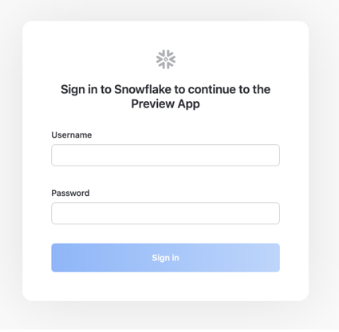

# Projet module architecture Big Data :

Chaque jour, des milliers d'entreprises et de particuliers se tournent vers LinkedIn à la recherche de talents.
Le jeu de données que vous allez explorer contient plusieurs milliers d'offres d’emploi.
Pour pouvoir interagir avec les différents jeux de données aux formats CSV et JSON, vous commencerez par charger chaque fichier dans une table de la base de données Snowflake.

Les fichiers sont disponibles dans le bucket S3 public : **s3://snowflake-lab-bucket/**.

Pour explorer les données avant de les charger dans snowflake, il suffit de cliquer sur le lien correspondant pour télécharger le fichier sur votre ordinateur.

* https://snowflake-lab-bucket.s3.eu-west-1.amazonaws.com/benefits.csv

* https://snowflake-lab-bucket.s3.eu-west-1.amazonaws.com/companies.json

* https://snowflake-lab-bucket.s3.eu-west-1.amazonaws.com/company_industries.json

* https://snowflake-lab-bucket.s3.eu-west-1.amazonaws.com/company_specialities.json

* https://snowflake-lab-bucket.s3.eu-west-1.amazonaws.com/employee_counts.csv

* https://snowflake-lab-bucket.s3.eu-west-1.amazonaws.com/industries.json

* https://snowflake-lab-bucket.s3.eu-west-1.amazonaws.com/job_industries.json

* https://snowflake-lab-bucket.s3.eu-west-1.amazonaws.com/job_postings.csv

* https://snowflake-lab-bucket.s3.eu-west-1.amazonaws.com/job_skills.csv

* https://snowflake-lab-bucket.s3.eu-west-1.amazonaws.com/salaries.csv

* https://snowflake-lab-bucket.s3.eu-west-1.amazonaws.com/skills.csv

## Prérequis pour le lab :

* Utilisation de l'environnement d’essai gratuit de 30 jours de Snowflake.

* Connaissances de base en SQL, Python et sur les concepts et objets des bases de données.

* Connaissance des formats de fichiers CSV (délimités par des virgules) et des fichiers semi-structurés JSON.

## Indications :

* L'ensemble de l'atelier doit être réalisé à travers des scripts (pas d’utilisation des fonctionnalités de l’interface graphique).

* Le rendu doit être un document contenant toutes les commandes exécutées lors de l’atelier, accompagnées de commentaires expliquant chaque étape.

* Les erreurs rencontrées durant la réalisation de l’atelier doivent être documentées dans le document à restituer.

* Le choix de chaque solution pour corriger une erreur doit être justifié et expliqué dans le document à restituer.

## Création d’un compte Snowflake gratuit (uniquement si votre compte a expiré) :
Rendez-vous sur ce lien : https://trial.snowflake.com pour créer un compte gratuit valable 30 jours.

Pour ce lab, choisissez :

* L'édition Standard Edition,

* Le fournisseur de cloud AWS,

* La région Europe (Irlande) eu-west-1.

Après l’inscription, vous recevrez un e-mail avec un lien d’activation et une URL pour accéder à votre compte Snowflake.

## Connexion à l’interface utilisateur (UI) de Snowflake :
Ouvrez une fenêtre de navigateur et saisissez l’URL de votre environnement d’essai Snowflake (fournie par e-mail). Vous devriez voir la boîte de dialogue de connexion suivante. Entrez le nom d’utilisateur et le mot de passe que vous avez choisis lors de l'inscription :

## Chargement des données :
Présentation du jeu de données :

**Jobs_posting :** 

|Column |                      Description  |
|--------|-----------------------------------|  
|job_id                    | The job ID as defined by LinkedIn (https://www.linkedin.com/jobs/view/{job_id})|
|company_id	               | Identifier for the company associated with the job posting (maps to companies.csv)  |
|title	                   | Job title  |
|description	           |     Job description  |
|max_salary	               | Maximum salary  |
|med_salary	               | Median salary  |
|min_salary	               | Minimum salary  |
|pay_period	               | Pay period for salary (Hourly, Monthly, Yearly)  |
|formatted_work_type	   |     Type of work (Fulltime, Parttime, Contract)  |
|location	               | Job location  |
|applies	               |     Number of applications that have been submitted  |
|original_listed_time	   | Original time the job was listed  |
|remote_allowed	           | Whether job permits remote work  |
|views	                   | Number of times the job posting has been viewed  |
|job_posting_url	       |     URL to the job posting on a platform  |
|application_url	       |     URL where applications can be submitted |  
|application_type	       | Type of application process (offsite, complex/simple onsite)  |
|expiry	                   | Expiration date or time for the job listing  |
|closed_time	           |     Time to close job listing  |
|formatted_experience_level	Job | experience level (entry, associate, executive, etc)  |
|skills_desc	           |    Description detailing required skills for job  |
|listed_time	           |   Time when the job was listed  |
|posting_domain	           | Domain of the website with application  |
|sponsored	               |Whether the job listing is sponsored or promoted  |
|work_type	               | Type of work associated with the job  |
|currency	               | Currency in which the salary is provided  |
|compensation_type	       | Type of compensation for the job  |
|scraped	               |     Has been scraped by details_retriever  |

**Salaries :**

|Column |                      Description  |
|--------|-----------------------------------|  
|salary_id	        |The salary ID|
|job_id	            |The job ID (references jobs table)|
|max_salary	        |Maximum salary|
|med_salary    	    |Median salary|
|min_salary	        |Minimum salary|
|pay_period	        |Pay period for salary (Hourly, Monthly, Yearly)|
|currency	        |Currency in which the salary is provided|
|compensation_type	|Type of compensation for the job (Fixed, Variable, etc)|

**Benefits :** 

|Column |                      Description  |
|--------|-----------------------------------|  
|job_id	    |The job ID|
|type	    |Type of benefit provided (401K, Medical Insurance, etc)|
|inferred	|Whether the benefit was explicitly tagged or inferred through text by LinkedIn|

**Companies :**

|Column |                      Description  |
|--------|-----------------------------------|  
|company_id	    |The company ID as defined by LinkedIn|
|name	        |Company name|
|description	|Company description|
|company_size	|Company grouping based on number of employees (0 Smallest - 7 Largest)|
|country	    |Country of company headquarters|
|state	        |State of company headquarters|
|city	        |City of company headquarters|
|zip_code	    |ZIP code of company's headquarters|
|address	    |Address of company's headquarters|
|url	        |Link to company's LinkedIn page|

**Skills :**

|Column |                      Description  |
|--------|-----------------------------------|  
|skill_abr	|The skill abbreviation (primary key)|
|skill_name	|The skill name|

**Employee_counts :**   

|Column |                      Description  |
|--------|-----------------------------------|  
|company_id	The |company ID|
|employee_count	|Number of employees at company|
|follower_count	|Number of company followers on LinkedIn|
|time_recorded	|Unix time of data collection|

**Job_Skills :**

|Column |                      Description  |
|--------|-----------------------------------| 
|job_id	    |The job ID (references jobs table and primary key)|
|skill_abr	|The skill abbreviation (references skills table)|

**Industries :** 

|Column |                      Description  |
|--------|-----------------------------------| 
|industry_id	|The industry ID (primary key)|
|industry_name	|The industry name|

**Job_Industries :**  

|Column |                      Description  |
|--------|-----------------------------------| 
|job_id	        |The job ID (references jobs table and primary key)|
|industry_id	|The industry ID (references industries table)|

**Company_specialities :**

|Column |                      Description  |
|--------|-----------------------------------| 
|company_id	|The company ID (references companies table and primary key)|
|speciality	|The speciality ID|

**Company_industries :**

|Column |                      Description  |
|--------|-----------------------------------| 
|company_id	|The company ID (references companies table and primary key)|
|industry	|The industry ID (references industries table)|

## Commençons par préparer le chargement des données.

Voici la liste des étapes pour charger les données dans Snowflake :

1. Créez une nouvelle base de données appelée "linkedin".

2. Créez un stage spécifiant l’emplacement du bucket S3.

3. Créez le format de fichier correspondant à la structure des données à charger.

4. Créez les différentes tables en vous basant sur les descriptions ci-dessus.

5. Chargez les données dans les tables.

6. Effectuez des transformations si nécessaire pour rendre les données exploitables.

## Analyse des données :

Avec un tel volume, le potentiel d’analyse est vaste : exploration des postes, des entreprises et des localisations les mieux rémunérés, ou encore des tendances par industrie ou par type d’avantages offerts.

Une fois les fichiers correctement chargés dans les tables, vous pourrez commencer à analyser les données et répondre aux questions suivantes :

1. Quel est le top 10 des titres de postes les plus publiés par industrié ?

2. Quel est le top 10 des postes les mieux rémunérés par industrié ?

3. Quelle est la répartition des offres d’emploi par taille d’entreprise ?

4. Quelle est la répartition des offres d’emploi par secteur d’activité ?

5. Quelle est la répartition des offres d’emploi par type d’emploi (temps plein, stage, temps partiel) ?

6. Pour chacune des questions ci-dessus, créez un graphique avec Streamlit pour illustrer les résultats.

## Livrable :

Le livrable attendu pour ce projet est un document détaillant chaque étape :

* Les commandes SQL utilisées et les résultats obtenus.

* Le code Streamlit de chaque visualisation et les résultats obtenus..

* Les problèmes/erreurs rencontrés.

* La solution mise en place pour corriger chaque problème.

* Des commentaires pour expliquer chaque étape.

Le projet doit être réalisé par groupes de deux, avec une répartition équitable de la charge de travail.
Les groupes présentant des livrables identiques seront sanctionnés.

Le livrable doit être envoyé sur cette adresse: **axel@logbrain.fr**.
